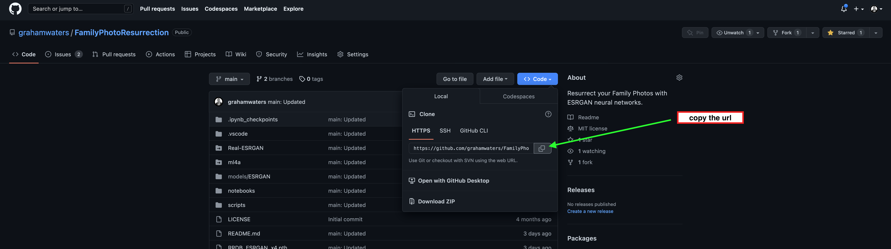
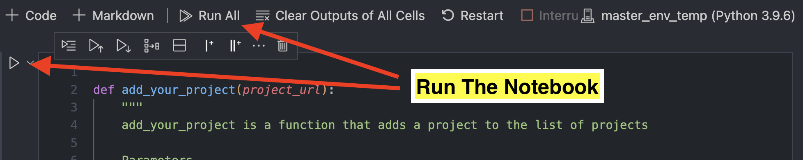
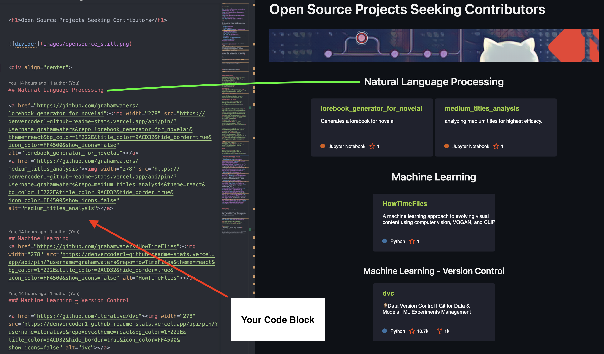
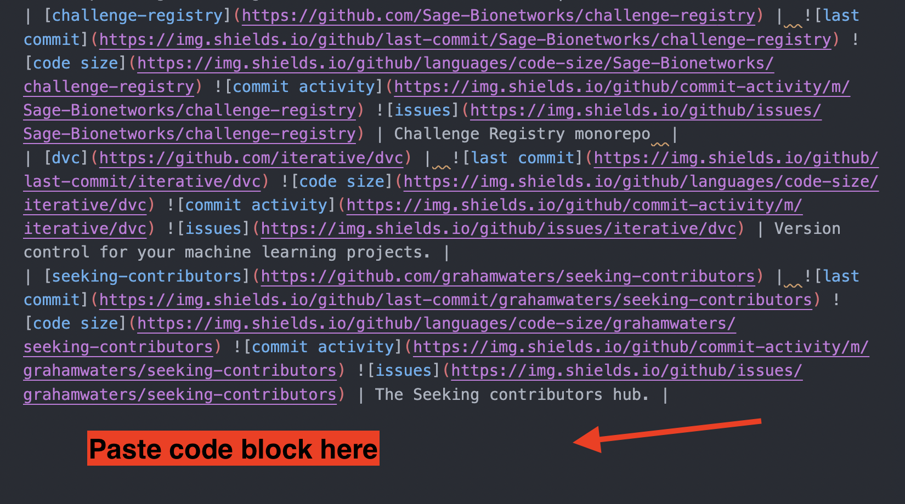

# Adding Projects

*This file was written by Graham Waters, please feel free to [contact](https://www.linkedin.com/in/grahamwatersdatascientist/) me with any questions.*

*If you are having technical issues with the repository and would like us to review your repo for you then please add it using this [google form](https://forms.gle/wQJpnGvizNWKydVi9) and we will work on it as soon as we can! Thank you!*

# How to Add A Project
Adding your project is as simple as copying the url of your repo and following the instructions below.

## Instructions

1. Fork this repository first.
2. Then git clone the repo to your local machine.
3. Make your edits to the repo by following the instructions below.

## Post-Cloning Instructions

* Copy the url of your repo on GitHub.

* Open ['helper_functions.ipynb' notebook](notebooks/helper_functions.ipynb).

Once you have opened the notebook, you will see a function called `add_your_project` in the first cell. This function takes the url of your repo as an argument. All you have to do is run the notebook.

* A `Badge` Generated with the ['helper_functions.ipynb' notebook](notebooks/helper_functions.ipynb). This file is included in this repo, and it will guide you through the process when you run it. It will likely take you around one minute.

This `Badge` will be added to the badge wall for users to peruse. The example badge below gives you an idea of how nice a project can look with just a few lines of extra formatting.

* Now, all you need to do is copy the first markdown block, and paste it under the appropriate heading in the main [readme](/README.md) file.

* The `Badge` will be added to the badge wall for users to peruse. The example badge below gives you an idea of how nice a project can look with just a few lines of extra formatting.

Then add the second block of code (the table portion) to the [project_board.md](/project_board.md) file. This will be the table of the repositories that displays badging and descriptions for each project.

This will populate a row in the table with the following information:

# Last Step(s)

* Now you have saved your changes. Commit those changes to your fork of the repository.

* Submit a Pull Request to the master branch and we will review your submission and if needed make any syntax adjustments before we merge it into the main repo!