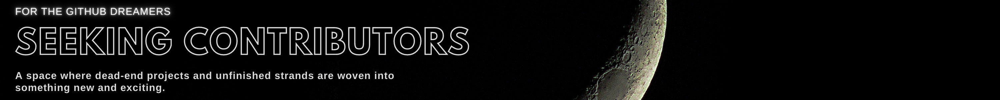

<div align='center'>


</div>

## Welcome to Seeking Contributors
This will be a forum for sharing your little projects on your back shelf or where old flames get reignited and passion builds advancement.


- [Adding Projects](#adding-projects)
  - [Example code block to copy and paste](#example-code-block-to-copy-and-paste)
  - [Natural Language Processing](#natural-language-processing)
  - [Machine Learning](#machine-learning)
    - [Machine Learning - Version Control](#machine-learning---version-control)
  - [Game Development for Deep Learning](#game-development-for-deep-learning)
  - [Web Scraping](#web-scraping)
  - [Data Science Tools](#data-science-tools)
  - [Data Science General](#data-science-general)
  - [Data Science for Social Good](#data-science-for-social-good)
  - [Other](#other)
- [Table of Projects with Badging and Descriptions](#table-of-projects-with-badging-and-descriptions)
  - [Acknowledgements](#acknowledgements)
- [Caffeine and Sundry Necessities](#caffeine-and-sundry-necessities)

# Adding Projects

To add your project, you will need several details. Follow these steps.

1. Project Name ( for example, "PySeas" is one of my repos that I am seeking contributors for, so the name is just "PySeas")
2. Description of your project (if applicable)
3. A `Badge` Generated with the ['helper_functions.ipynb' notebook](notebooks/helper_functions.ipynb). This file is included in this repo, and it will guide you through the process when you run it. It will likely take you around one minute.

This `Badge` will be added to the badge wall for users to peruse. The example badge below gives you an idea of how nice a project can look with just a few lines of extra formatting.


<div align='center'>

<a href="https://github.com/grahamwaters/lorebook_generator_for_novelai"></a>

</div>
4. Now, all you need to do is copy that markdown-ready block, paste it under the appropriate heading in the readme, and submit a pull request!

## Example code block to copy and paste
```output
<a href="https://github.com/grahamwaters/lorebook_generator_for_novelai"></a>
```

<strong>Note: If you do not see a category for your project in the headings, please create a new category with the same format as the other headings, and we will add it to the list.</strong>


---


<h1>Open Source Projects Seeking Contributors</h1>


## Natural Language Processing

<a href="https://github.com/grahamwaters/lorebook_generator_for_novelai"></a>
<a href="https://github.com/grahamwaters/medium_titles_analysis"></a>


## Machine Learning
<a href="https://github.com/grahamwaters/HowTimeFlies"></a>

### Machine Learning - Version Control

<a href="https://github.com/iterative/dvc"></a>

## Game Development for Deep Learning

<a href="https://github.com/grahamwaters/github-readme-streak-stats"></a>


## Web Scraping

<a href="https://github.com/grahamwaters/druginfo_scraper"></a>
<a href="https://github.com/grahamwaters/PySeas"></a>
<a href="https://github.com/talkygram/webcrawly"></a>
## Data Science Tools

<a href="https://github.com/grahamwaters/Clark-Kent-Reporter"></a>

## Data Science General


<a href="https://github.com/BKAmos/DataScience"></a>
<a href="https://github.com/VanillaLattA/DatascienceShortcuts"></a>
<a href="https://github.com/Joyel1441/DatasetHelper"></a>

## Data Science for Social Good

<a href="https://github.com/Muskan33/Machine-Learning-Project"></a>

## Other

<a href="https://github.com/Sage-Bionetworks/challenge-registry"></a>


# Table of Projects with Badging and Descriptions
<!-- populate a table with the projects listed above -->
| **Project Name** | **Badges** | **Description** |
|---|---|---|
| [Lorebook Generator for NovelAI](https://github.com/grahamwaters/lorebook_generator_for_novelai) |      | A Python script that generates a custom JSON lorebook (based on pulls from Wikipedia articles) for the website NovelAI. |
| [DatasetHelper](https://github.com/Joyel1441/DatasetHelper) |      | DatasetHelper |
| [MechanicalSoup](https://github.com/MechanicalSoup/MechanicalSoup) |      | A Python library for automating interaction with websites. MechanicalSoup automatically stores and sends cookies, follows redirects, and can follow links and submit forms.  |
| [druginfo_scraper](https://github.com/grahamwaters/druginfo_scraper) |      | A simple webscraper to gather drug information from web sources. |
| [challenge-registry](https://github.com/Sage-Bionetworks/challenge-registry) |      | Challenge Registry monorepo  |
| [dvc](https://github.com/iterative/dvc) |      | Version control for your machine learning projects. |
| [seeking-contributors](https://github.com/grahamwaters/seeking-contributors) |      | The Seeking contributors hub. |


## Acknowledgements

- Graham Waters, Data Scientist & ML Researcher


# Caffeine and Sundry Necessities
If you'd like to contribute to the hours, I spend staring at my screen in deep concentration, I welcome any caffeine donations. ☕ Also, if you'd like to sponsor a project you see on my page, please let me know where I should focus my attention. Open Source is a big brave new world. Cheers!

<div align='center'>

[](https://www.buymeacoffee.com/grahamwaters)

<a href="https://discord.com/users/its_graham#7425" target="_blank" rel="noreferrer"></a>

</div>

<p align="center">
  Humans Encountered since this counter was created:<br>
  
</p>


<!-- https://github.com/search?q=data+science+help+label%3A%22help+wanted%22+repos%3A%3C100+language%3APython+state%3Aopen+language%3APython&type=Issues&ref=advsearch&l=Python&l=Python -->